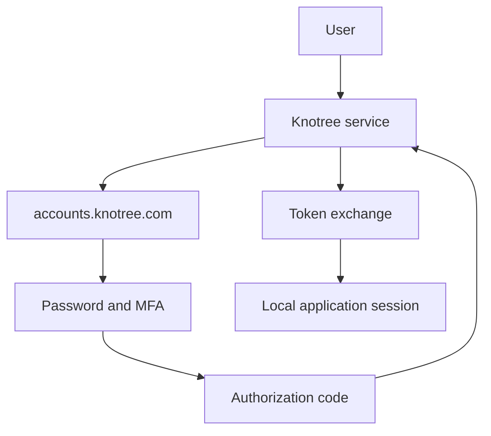
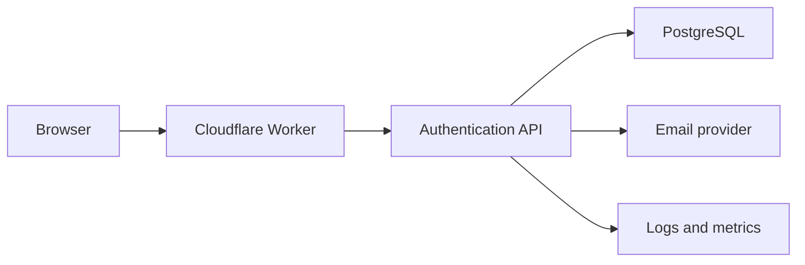

# Architecture

Knotree Authentication (`accounts.knotree.com`) is the identity provider for `*.knotree.com`. Product sites do not store passwords. They redirect to this service and accept an OpenID Connect authorization-code result.

## Boundaries

The browser talks only to `accounts.knotree.com`. The Cloudflare Worker serves the React application and proxies `/api`, `/oauth`, `/.well-known`, `/health`, and `/ready` to the Rust API. The session cookie is host-only on that origin. It is not a parent-domain cookie for `.knotree.com`.

The API is stateless aside from PostgreSQL. Rate limits, sessions, refresh-token families, and email outbox rows live in the database so replicas share one view.

## Token model

| Credential | Form | Storage |
| --- | --- | --- |
| Browser session | Opaque, HttpOnly cookie | SHA-256 hash |
| Access token | Opaque bearer | SHA-256 hash, 15 minutes |
| ID token | RS256 JWT | Not stored; verified via JWKS |
| Refresh token | Opaque, rotated | SHA-256 hash, family reuse detection |
| Authorization code | Opaque, 60 seconds, single use | SHA-256 hash, PKCE S256 |
| Email verification, reset, email OTP | High-entropy or 6-digit OTP | SHA-256 hash, purpose-bound |
| TOTP secret | Base32 shown once | AES-256-GCM |
| Recovery code | 20-character grouped code | SHA-256 hash, single use |

Refresh rotation is strict. Presenting a used refresh token revokes the family and the bound session. There is no grace window, because the successor secret is not stored.

## Modules

The API is one crate, `knotree-accounts`. HTTP handlers in `http` validate cookies and CSRF, then call `auth`, `oauth`, and `admin`. Those modules own transactions. Email sending goes through `EmailProvider`.
